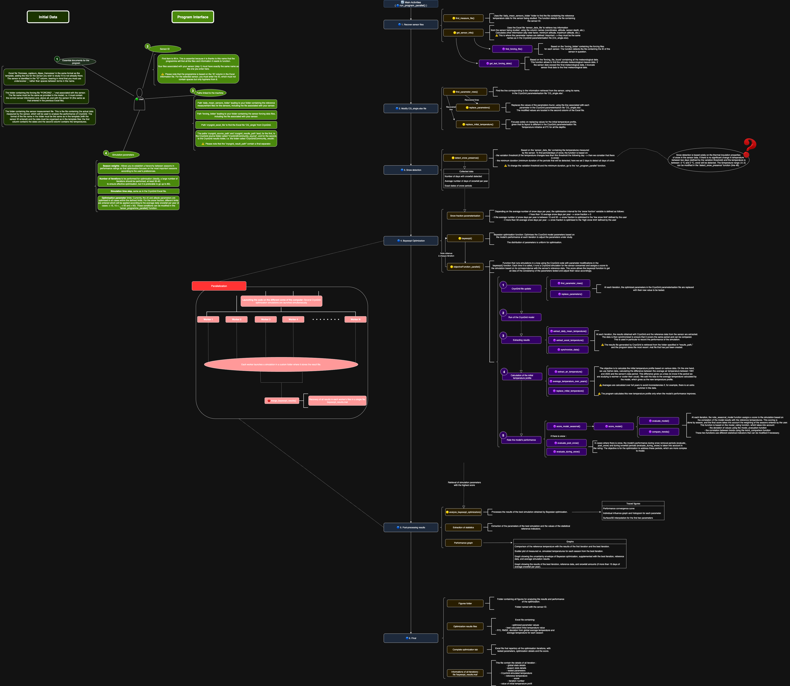

# API Reference

This section provides a detailed overview of the MATLAB functions, scripts, and structure of the 
**CryoGrid Optimization Automatization** project.

---

## Project Architecture (UML Diagram)


<div style="overflow-x: auto; border: 1px solid #ddd; padding: 10px; width: 100%;">
  <div style="width: 1200px;"> <!-- largeur réelle de l'image -->
    
  </div>
</div>


The above diagram summarizes how the main script (`main_optimization_parallel.m`) interacts with the
helper functions and CryoGrid modules.


## Main Script
```
main_optimization_parallel.m
```

Feature	Description :
- Role : Entry point for the entire workflow. Handles setup, optimization, and output generation.
- Inputs : Sensor ID, paths to (`data/forcing`) folders, CryoGrid input Excel file and path, optimization settings.
- Outputs : Results in (`CryoGridCommunity_results/`) (Excel files, plots, MATLAB .mat summaries).
- Key : Dependencies (`run_program_parallel.m`), (`objectiveFcn_parallel.m`) and all helped functions in the folder.
- Notes: This is the only script you typically edit to configure a new simulation.


## Workflow Functions (src/functions)

```{list-table} Workflow Functions
:header-rows: 1
:widths: 20 40 20 20

* - Function
  - Description
  - Key Inputs
  - Key Outputs
* - `run_program_parallel.m`
  - Supervises parallel worker execution, calls CryoGrid simulation, and collects results.
  - Sensor ID, paths, parameters
  - Results from each parallel simulation
* - `find_measure_file.m`
  - Find the sensor's CSV daily_mean file in the folder by the sensor's ID.
  - Sensor ID, daily_mean folder path
  - Sensor's measure file
* - `get_sensor_info.m`
  - Function which recover the sensor data in the PAPPROG_data.xlsx file.
  - Sensor ID, PAPROG Excel file
  - Structured sensor data
* - `find_forcing_file.m`
  - Find the sensor's .mat forcing file in the folder by the sensor's ID.
  - Sensor ID, forcing data folder path
  - Sensor's forcing file
* - `find_parameter_rows.m`
  - Find the parameter row in the CryoGrid Excel file.
  - CryoGrid excel file, parameters name
  - Parameters rows in the CryoGrid file
* - `replace_parameters.m`
  - Replace the new parameter value in the CryoGrid Excel file.
  - Parameters row
  - Updated CryoGrid Excel file
* - `replace_initial_temp.m`
  - Replace only the initial temperature value un the CryoGrid Excel file, because it's different that other parameters.
  - Intial temperature first row
  - Updated CryoGrid Excel file
* - `detect_snow_presence.m`
  - Detects snow cover periods from daily temperature measurements.
  - CSV file (daily temps)
  - Snow cover periods (indices, plots)
* - `analyze_bayesopt_optimization.m`
  - Create the basics optimization performance plot.
  - Bayesian optimization results
  - Basic optimization performance plot
* - `merge_bayesopt_results.m`
  - Merge all the optimization workers results files.
  - PResults folder
  - Complete optimization result file
* - `objectiveFcn_parallel.m`
  - Objective function used by Bayesian optimization (`bayesopt`).
  - Parameters (albedo, z0, snow_fraction)
  - Simulation score
* - `run_CG_from_excel.m`
  - Function that allow to launch CryoGrid script in a loop.
  - Excel metadata, sensor ID
  - CryoGrid results
* - `extract_mean_temperature.m`
  - Function which extract the simulated CryoGrid temperature results at the sensor depth.
  - CryoGrid result file, sensor depth, altitude
  - Simulated temperature and date vector
* - `extract_excel_temperature.m`
  - Extract sensor measure dates and temperature values.
  - CSV file (daily temps)
  - Sensor observed dates and temperature
* - `average_temperature_over_years.m`
  - Calculates the difference mean temperature by each year mean (Avoids bias if it miss a season in the measure.
  - Simulated and observed temperature vectors
  - Mean difference temperature
* - `synchronize_data.m`
  - Truncates the observed and simulated data to the same size.
  - Simulated and observed date and temp vectors
  - Simulated and observed date and temp vector with the same size
* - `score_model_seasonal.m`
  - Calculates seasonal performance metrics (RMSE, bias, seasonal fit, etc ...).
  - Simulated and observed temperature vectors
  - Score, all global and seasonal statistics indicators per season
* - `score_model.m`
  - Calculates a performance model score by key statistics indicators values.
  - Stats and trends from following functions
  - Performance score and key statistics indicators values
* - `evaluate_model.m`
  - Calculates the key statistics indicators values (RMSE, Bias, R2...).
  - Simulated and observed temperature vectors
  - Structured key statistics indicators values
* - `compare_trends.m`
  - Calcules the key trends indicators values (slope, Sperman correlation, ...).
  - Simulated and observed temperature vectors
  - Structured key trend indicators values
* - `evaluate_post_snow.m`
  - Calculates the model performance during the five days after the snow periods.
  - Snow periods
  - Model performance score after snow period
* - `evaluate_during_snow.m`
  - Calculates the model performance during the snow periods.
  - Snow periods
  - Model performance score during snow period
* - `extract_air_temperature.m`
  - extracts air temperature from forcing file. It allows to updated the initial temperature profil
  - Forcing file
  - Air temperature vector from forcing file
  
```


## Optimization Logic

```{list-table} Core Components
:header-rows: 1
:widths: 20 80

* - Component
  - Description
* - **Bayesian Optimization**
  - Global parameter search using `bayesopt`. Optimizes `albedo`, `z0`, `snow_fraction`. It based on the Bayesian method, and the searching parameters distribution is uniform.
* - **Parallelization**
  - MATLAB Parallel Computing Toolbox used to run simulations concurrently.
* - **Lock Mechanism**
  - `.lock` files created in temp folders to avoid race conditions. There is a lock file to register each iteration number and score.
```


## CryoGrid Modules (CryoGrid/)

```{list-table} CryoGrid Modules
:header-rows: 1
:widths: 25 75

* - Folder
  - Description
* - `CryoGridCommunity_source/`
  - Core CryoGrid model source docs ans script.
* - `CryoGridCommunity_results/`
  - Output directory containing simulation results, plots, and Excel summaries.
* - `CG_single.xlsx`
  - CryoGrid input Excel file updated dynamically by scripts.
* - `CONSTANTS_excel.xlsx`
  - Stores default physical constants and parameter ranges.
```


## Data Structure

```{list-table} Data Structure
:header-rows: 1
:widths: 25 75

* - Folder
  - Description
* - `data/Daily_mean/`
  - Contains daily temperature CSV files.
* - `data/PAPROG_Data_set.xlsx`
  - Excel file with sensor metadata (altitude, slope, massif ID, etc.).
* - `forcing/Forcing_Data/`
  - `.mat` files containing CryoGrid forcing (precipitation, temperature, etc.).
```


## Temperature profile initialization logic

In the `CG_single.xlsx` file, you have to put an initial temperature profile that is the supposed 
existing temperature column at the near-surface measurement site and that is therefore the inherited 
ground temperature conditions. 

```{figure} _static/initial_temperature_profil.png
---
width: 600px
align: center
name: Initial-temp-profile
---
Visualization of 'CG_single.xlsx' part with the initial temperature profil
```

In this optimization logic, it is first initialize at 0°C. We then try to assume the inherited temperature
profile. All layers are initialized at the same temperature for simplicity, and because these are 
near-surface sensors, the programme focuses solely on near-surface temperature. To do so, every time there is a better 
simulation (a better score), this profile `T_ini` is updated with this logic : 

- calculation of `T_mean_ref` : the forcing data mean air temperature at the sensor location between 
1991, January 1st and 2020, December 31th that is supposed to be representative of the climate 
condition at the measurement site
- calculation of `T_mean_sensor` : the forcing data mean annual air temperature between the first day of 
the measurement time serie and the 365th day of the time serie and that is representative of the 
climate during the measurement period
- calculation of `T_mean_cryo` : the mean annual near-surface temperature simulated with CryoGrid 
between the first and the 365th day of the simulated time serie

--> The new initial temperature profile is : `T_ini = T_mean_cryo - abs(T_mean_sensor - T_mean_ref)`


## Score logic

To the oprimization be performant, the objective function have to score the simulation performance
compared to the reference sensor temperature measures. 

The score is build like this : 

- 10 points based on the RMSE value
- 20 points based on the MAE value
- 20 points based on BIAS value
- 20 points based on R^2 value
- 10 points based on mean difference temperature value

- 10 points based on slope difference value
- 10 points based on Spearman's rho value
- 10 points based on Directional agreement value 

Total score on 110 points, normalized to 100 points. 

This evaluation is done for all the season, and the final score is a ponderation of the each season 
score based on the season weights.

If you want to modify the score repartition, you have to do it in the `score_model.m` function. The season
weights are defined in the initial configuration on the main script.


## Extending the Code

### Adding a New Sensor

1. Add the new daily CSV file to (`data/Daily_mean/`).

2. Add metadata line to (`PAPROG_Data_set.xlsx`), with a new sensor ID.

3. Generate a forcing .mat file and place it in (`forcing/Forcing_Data/`).

4. Update informations in (`main_optimization_parallel`).

### Adding a New Parameter to Optimize

1. Adapte the parameter updating. Search where this parameter is between the (`CG_single.xlsx`) or (`CONSTANTS_excel.xlsx`) 
files. It's important to know in which file this parameter is. First because the actual optimized parameters 
are all in the (`CG_single.xlsx`), so the (`find_parameter_rows`) adn (`replace_parameters`) functions take 
(`CG_single.xlsx`) in argument and search in this file. If your new parameter is in the (`CONSTANTS_excel.xlsx`)
file, you should add a step in (`run_program_parallel`) with the seraching functions with this new argument. 
Second, the parameter remplacement is made by dettecting the line with the parameter name, and change the 
value in the same line in the next column. But if the configuration is different you should modifiy or create 
a special function.

2. Update Bayesian optimization variable definitions in the main.


## References

- [MATLAB Documentation](https://www.mathworks.com/help/matlab/)

- [CryoGrid Community](https://cryogrid-documentation.readthedocs.io/en/latest/)

- [Bayesian Optimization in MATLAB](https://fr.mathworks.com/help/stats/bayesian-optimization-algorithm.html)


 
 
 
 
 
 
 
 
 
 
 